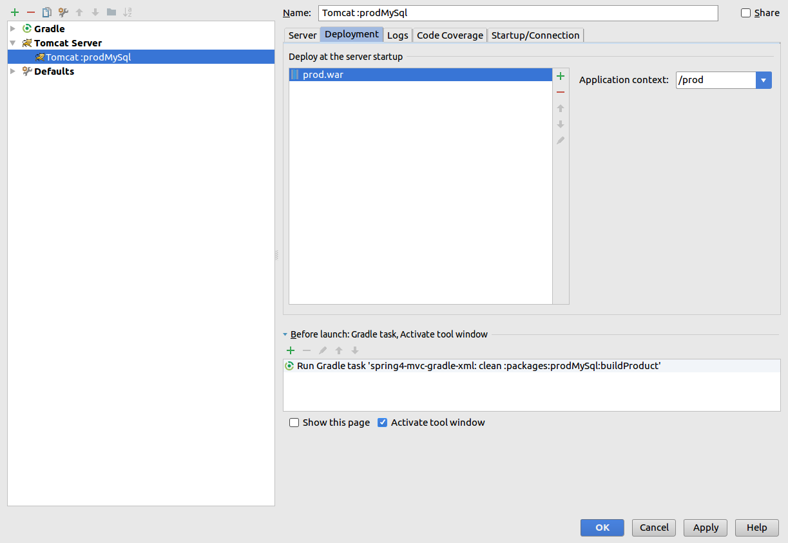
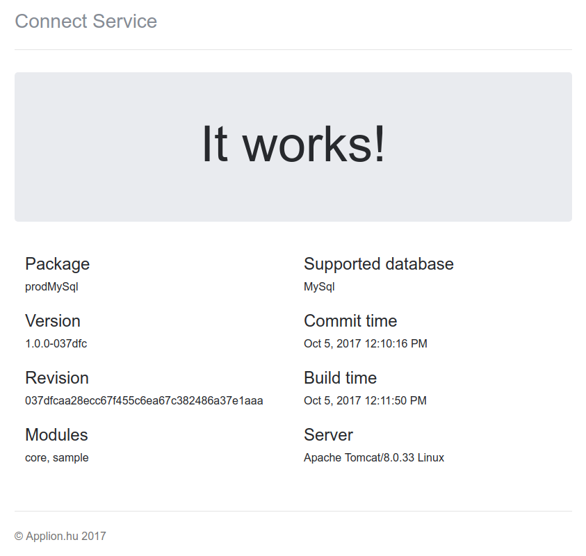
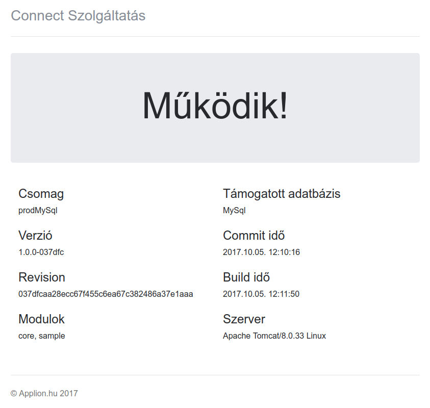

# Development

## Infrastructure mode (preferred)

In this mode you have a configured server, no need to use gradle to run the server.

### Attach Intellij IDEA debugger

#### Create the Run configuration

Execute the following steps at the first time. \
The selected package: `prodMySql`

1. `Edit configurations...`
0. `+` button
0. `Tomcat server` -> `Local`
0. `Deployment` tab -> `+` button -> `External source`
0. Choose `packages/prodMySql/build/output/prodMySql/webapps/prod.war`
0. Application context: `/prod` (or what you want)
0. `Before launch` -> `Run gradle task`: select the root module, type task: `clean :packages:prodMySql:buildProduct`
0. `Server` tab -> Choose your configured application server
0. (Optional) `Open browser`: `http(s)://localhost:$PORT/prod/`
0. Name: `Tomcat :prodMySql`

The result:
 

#### Use the Run configuration

You can attach the debugger any time, just execute the following steps.

1. Select `Tomcat :prodMySql` from the list.
0. Press the debug button.

### Server log

You can see the server log inside IDEA.

## Ad-hoc mode

In ad-hoc mode you have no configured server, gradle creates it.

**NOTE:** Documentation of this block is not up-to-date.

### Start Tomcat server in debug mode

Execute this command to build and run `sample` module: \
`./gradlew :sample:tomcatStartDebug --info`

Switch `--info` prints some info log.
If everything is OK, you see this output at the end:\
`Listening for transport dt_socket at address: 5005`

### URL

Here is the index URL for `sample` module:\
`http://localhost:8080/sample`

### Attach Intellij IDEA debugger

#### Create the Run configuration

Execute the following steps at the first time.

1. `Edit configurations...`
0. `+` button
0. `Remote`
0. Host: `localhost`, port: `5005`
0. Name: `Debug server`

#### Use the Run configuration

You can attach the debugger any time, just execute the following steps.

1. Start the server in debug mode.
0. Select `Debug server` from the list.
0. Press the debug button.

### Server log

Log files can be found in the `~/logs` directory.\
Example for `sample` module: `~/logs/sample.log`

NOTE: Character `~` means the user home.

# Release

Before build:\
Change the version name in `gradle.properties`.\
Commit, tag and push it. (Optionally do this on a release branch.)\
Now your git working directory is clean.

Execute:\
`./gradlew clean buildAllProducts`

That's all. You can find the outputs in each module.\
Example for `prodMySql` package module:\
`packages/prodMySql/build/output/prodMySql`

The WAR files are in the `webapps` directory.

# More info

- [Gretty](http://akhikhl.github.io/gretty-doc/): The gradle plugin that we use for build WARs.
- [grgit](https://github.com/ajoberstar/grgit): The Groovy way to use Git.
- [gradle-buildconfig-plugin](https://github.com/mfuerstenau/gradle-buildconfig-plugin): A gradle plugin that generates build configuration Java class.

# Welcome page
 

